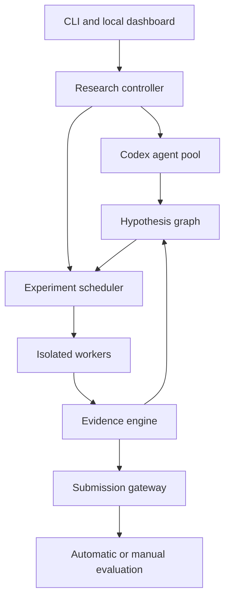

Yes. The strongest version would be a local-first CLI that turns a competition repository into an autonomous research laboratory. Codex handles reasoning and coding through the user’s ChatGPT/Codex entitlement; the tool itself handles orchestration, experiments, GPUs, evidence, memory, validation, and submissions.

Call it, for example, `sota`.

```bash
sota init
sota inspect
sota research --budget 24h
sota status
sota submit
```

## 1. Important Codex-subscription constraint

Use the official TypeScript package:

```bash
npm install @openai/codex-sdk
```

The SDK can start, continue, and resume local Codex threads:

```ts
import { Codex } from "@openai/codex-sdk";

const codex = new Codex();
const thread = codex.startThread();

const result = await thread.run(`
Inspect the competition repository.
Return a structured assessment of the current baseline,
validation weaknesses, and five testable hypotheses.
`);
```

The SDK is available to ChatGPT Plus, Pro, Business, Edu, and Enterprise users, according to the current official documentation. It uses the same Codex environment and authentication as the CLI. [Codex SDK documentation](https://developers.openai.com/codex/codex-sdk)

For a personal local workstation, the user runs:

```bash
codex login
```

and chooses ChatGPT authentication. For scripts, `codex exec` also supports non-interactive execution. [Codex authentication](https://developers.openai.com/codex/auth) and [non-interactive mode](https://developers.openai.com/codex/non-interactive-mode)

Important limitations:

* A subscription is not unlimited inference.
* Agent runs count against the user’s applicable Codex usage limits.
* You cannot assume that 100 or 10,000 simultaneous subscription-backed agents will be allowed.
* The orchestrator must impose concurrency, rate, and usage limits.
* Do not extract tokens or implement unofficial ChatGPT API calls.
* Use the official SDK, CLI, or app-server.
* For remote unattended infrastructure, API-key authentication is generally recommended; ChatGPT-managed authentication is best for a trusted personal machine.
* Business and Enterprise workspaces can use official Codex access tokens for trusted automation.

For your system, I would use the SDK for persistent agents and `codex exec --json` for disposable, isolated jobs.

---

# 2. Product definition

The tool’s job is:

> Given a competition description, data, rules, code and compute budget, autonomously form hypotheses, implement experiments, run them, evaluate them under imperfect validation, accumulate evidence, and produce or submit improved solutions.

It should support:

* classification, regression and ranking;
* images, videos, text, tabular, time series and multimodal data;
* Kaggle API submission;
* arbitrary HTTP submission adapters;
* manual upload workflows;
* local-only competitions;
* local GPUs and Modal/cloud GPUs;
* multiple Git-isolated research branches;
* paper and repository retrieval;
* hypothesis and experiment memory;
* multi-split validation;
* ensemble discovery;
* human approvals;
* resumability after crashes.

---

# 3. Top-level architecture



The system should be a durable workflow engine. LLM messages must never be the source of truth.

The source of truth consists of:

* relational database;
* immutable experiment manifests;
* Git commits;
* run artifacts;
* prediction files;
* evaluation reports;
* event log.

---

# 4. Recommended implementation stack

## Core CLI

Use:

* TypeScript
* Node.js 20+
* `commander` or `oclif`
* `@openai/codex-sdk`
* `zod` for schemas
* `drizzle-orm` or Prisma
* SQLite initially, PostgreSQL optionally
* `pino` for structured logging
* `execa` for subprocess management
* `ink` for a rich terminal UI
* Fastify for a local API/dashboard backend

## ML workers

Use Python because competition ecosystems are Python-centric:

* PyTorch
* Lightning or Accelerate
* scikit-learn
* Polars/Pandas
* Hydra/OmegaConf
* Optuna
* MLflow
* DuckDB
* PyArrow
* NumPy/SciPy
* Albumentations
* Hugging Face libraries as optional plugins

The TypeScript controller invokes Python through a stable worker protocol rather than embedding Python internally.

## Isolation

Support three executors:

1. Local process
2. Docker/Podman container
3. Modal job

Later add Kubernetes, RunPod, Vast.ai and Slurm adapters.

---

# 5. Repository layout

```text
competition-project/
├── competition.yaml
├── AGENTS.md
├── README.md
├── src/
├── configs/
├── tests/
├── data/
│   ├── raw/
│   ├── processed/
│   └── manifests/
├── validation/
│   ├── splits/
│   └── policies/
├── submissions/
├── reports/
├── .sota/
│   ├── database.sqlite
│   ├── events.jsonl
│   ├── state/
│   ├── prompts/
│   ├── worktrees/
│   ├── runs/
│   ├── artifacts/
│   ├── cache/
│   └── locks/
└── sota.lock
```

Never give agents uncontrolled access to raw credentials or unrelated directories.

---

# 6. Competition configuration

```yaml
schema_version: 1

competition:
  name: virtual-embryo-2026
  platform: manual
  task: video_classification
  metric:
    name: macro_f1
    direction: maximize
  rules_file: rules.md
  submission_limit: 10
  daily_submission_limit: 2

dataset:
  train_manifest: data/manifests/train.parquet
  test_manifest: data/manifests/test.parquet
  target: label
  sample_id: sample_id
  groups:
    - embryo_id
    - acquisition_site
  sensitive_columns:
    - source_path
    - uploader
  external_data: approval_required

validation:
  primary: stratified_group_kfold
  folds: 5
  seeds: [17, 41, 73]
  secondary:
    - source_holdout
    - temporal_holdout
  untouched_holdout:
    enabled: true
    fraction: 0.1
    reveal_policy: final_only

An adapter may expose a cheap successive-halving gate through the project manifest:

```json
{
  "execution": {
    "reducedValidationCommand": ["python", "run_experiment.py", "--folds", "1", "--epochs", "1"]
  }
}
```

Evidra runs this command on the selected executor before full validation, records its metric and provenance, and refuses to spend full compute when the reduced gate fails. The reduced stage intentionally has no final-artifact requirement; the full stage remains responsible for required predictions, metrics, and checksums.

compute:
  local:
    enabled: true
    devices: ["cuda:0"]
    max_parallel_jobs: 1
  modal:
    enabled: true
    gpu_types: ["A100-40GB", "A100-80GB"]
    max_parallel_jobs: 3
  budget:
    gpu_hours: 100
    monetary_usd: 150

agents:
  provider: codex_subscription
  max_parallel: 6
  reasoning_effort: high
  roles:
    - director
    - data_detective
    - validation_scientist
    - model_researcher
    - experiment_engineer
    - critic

autonomy:
  edit_code: automatic
  install_dependencies: approval_required
  download_public_data: approval_required
  submit_predictions: approval_required
  modify_validation: approval_required
  delete_artifacts: forbidden
```

---

# 7. Agent architecture

Use persistent agents for roles that need long-term continuity and disposable agents for reviews.

## Persistent agents

### Research director

Maintains the global research strategy:

* identifies bottlenecks;
* prioritizes hypotheses;
* allocates compute;
* stops unproductive directions;
* synthesizes evidence;
* schedules replications.

### Data detective

Investigates:

* distributions;
* mislabeled examples;
* missing values;
* duplicates;
* near-duplicates;
* hidden groups;
* identifiers;
* train/test shift;
* annotation artifacts;
* potential leakage.

### Validation scientist

Owns validation design and estimates how reliably local metrics predict hidden performance.

### Model researcher

Studies relevant methods and proposes testable adaptations.

### Ensemble scientist

Analyzes out-of-fold prediction diversity, error correlations and blend stability.

## Disposable agents

Create fresh contexts for:

* code review;
* leakage audit;
* statistical review;
* rule-compliance review;
* failed-run diagnosis;
* independent replication;
* proofreading conclusions.

Fresh reviewers are important because an agent that invented an approach is prone to defending it.

---

# 8. Agent output protocol

Do not parse arbitrary prose. Every agent returns validated JSON.

```ts
const HypothesisSchema = z.object({
  title: z.string(),
  mechanism: z.string(),
  evidence: z.array(z.string()),
  proposed_change: z.string(),
  falsification_test: z.string(),
  expected_metric_delta: z.object({
    low: z.number(),
    median: z.number(),
    high: z.number(),
  }),
  compute_cost_gpu_hours: z.number(),
  implementation_risk: z.enum(["low", "medium", "high"]),
  leakage_risk: z.enum(["low", "medium", "high"]),
  dependencies: z.array(z.string()),
});
```

Example:

```json
{
  "title": "Motion-aware temporal sampling",
  "mechanism": "Uniform sampling misses short developmental events.",
  "evidence": [
    "Errors concentrate in videos with brief high-motion intervals",
    "Optical-flow peaks occur outside selected frames in 31% of errors"
  ],
  "proposed_change": "Combine 8 uniform and 8 motion-selected frames",
  "falsification_test": "Compare paired OOF predictions on short-event subset",
  "expected_metric_delta": {
    "low": -0.001,
    "median": 0.005,
    "high": 0.012
  },
  "compute_cost_gpu_hours": 4,
  "implementation_risk": "medium",
  "leakage_risk": "low",
  "dependencies": ["baseline_v3"]
}
```

Invalid output is rejected and returned to the agent for correction.

---

# 9. Codex integration

Create a provider abstraction:

```ts
interface ResearchLLM {
  startAgent(config: AgentConfig): Promise<AgentHandle>;
  run(agent: AgentHandle, task: AgentTask): Promise<AgentResult>;
  resume(threadId: string, task: AgentTask): Promise<AgentResult>;
  cancel(runId: string): Promise<void>;
}
```

Codex implementation:

```ts
import { Codex } from "@openai/codex-sdk";

export class CodexProvider implements ResearchLLM {
  private client = new Codex();

  async startAgent(config: AgentConfig) {
    const thread = this.client.startThread({
      workingDirectory: config.worktree,
    });

    return {
      thread,
      threadId: thread.id,
      role: config.role
    };
  }

  async run(agent: AgentHandle, task: AgentTask) {
    const response = await agent.thread.run(
      renderAgentPrompt(agent.role, task)
    );

    return parseAndValidate(response.finalResponse, task.outputSchema);
  }
}
```

For batch reviews:

```bash
codex exec \
  --sandbox read-only \
  --json \
  "Audit experiment exp_0042 for target leakage."
```

Use subscription-backed agents only through official Codex authentication. The system should detect auth with:

```bash
codex login status
codex doctor
```

Do not copy or inspect the authentication token itself.

---

# 10. Prompt and context engineering

Every role gets:

* immutable role definition;
* competition rules;
* dataset manifest summary;
* research-state digest;
* relevant hypotheses;
* allowed actions;
* output schema;
* budget;
* exact completion condition.

Do not send the complete experiment history every time. Retrieve relevant memory.

Example director prompt:

```text
You are the research director for an ML competition.

Objective:
Maximize robust expected private-test performance.

Constraints:
- You may not use prohibited data.
- Public leaderboard feedback is sparse and noisy.
- Every proposal must be falsifiable.
- Compute remaining: 38 GPU-hours.
- Submissions remaining: 6.

Current evidence:
{{retrieved_evidence}}

Rejected directions:
{{relevant_failures}}

Return at most five hypotheses in the supplied JSON schema.
Rank by expected information gain per GPU-hour.
```

---

# 11. Research memory

Use three forms of memory.

## Relational state

Stores canonical entities:

* agents;
* hypotheses;
* experiments;
* runs;
* metrics;
* datasets;
* splits;
* submissions;
* reviews;
* artifacts;
* decisions;
* budgets.

## Event log

Append every state transition:

```json
{
  "time": "2026-09-09T10:31:22Z",
  "event": "experiment.completed",
  "experiment_id": "exp_0042",
  "run_id": "run_0191",
  "commit": "a84b7c1",
  "metrics_hash": "sha256:..."
}
```

This supports replay and crash recovery.

## Semantic retrieval

Index textual observations and conclusions in SQLite FTS initially. A vector database is optional, not mandatory.

Store statements as atomic evidence:

```text
Observation: Model B improves source-holdout F1 but not random CV.
Scope: video samples from acquisition site 3.
Confidence: 0.81.
Derived from: exp_0042, exp_0045.
```

Never let a generated summary overwrite primary results.

---

# 12. Hypothesis graph

Represent research as a directed graph:

```text
Observation → Hypothesis → Experiment → Result → Conclusion
                         ↘ Review
```

Entities have typed relationships:

* `supports`
* `contradicts`
* `depends_on`
* `replicates`
* `supersedes`
* `derived_from`
* `invalidated_by`
* `diverse_from`

This prevents redundant experiments and lets the system ask:

* What remains uncertain?
* Which assumption supports the current best model?
* Which improvement has not been independently replicated?
* Which failed approach may work under a different split?

---

# 13. Experiment specification

Every experiment is immutable after scheduling:

```yaml
id: exp_0042
parent: exp_0037
hypothesis: hyp_0018
git_commit: a84b7c1
dataset_version: sha256:abc123
split_version: sha256:def456

change:
  config_patch:
    temporal_sampler: motion_hybrid
    frames: 16

resources:
  executor: modal
  gpu: A100-40GB
  timeout_minutes: 240

evaluation:
  folds: [0, 1, 2, 3, 4]
  seeds: [17, 41, 73]
  required_artifacts:
    - metrics.json
    - predictions.parquet
    - environment.json
    - training.log

acceptance:
  minimum_primary_delta: 0.002
  maximum_regression_shift_split: 0.003
  require_replication: true
```

---

# 14. Git isolation

Every coding experiment gets its own worktree:

```text
.sota/worktrees/exp_0042/
```

Workflow:

1. Create branch from an explicit parent commit.
2. Create worktree.
3. Ask Codex to implement one hypothesis.
4. Run formatting and unit tests.
5. Run a tiny smoke-training job.
6. Have a separate Codex reviewer inspect the diff.
7. Commit automatically only if checks pass.
8. Schedule the full experiment.
9. Merge accepted improvements through a controlled integrator.

Never let multiple agents edit the same worktree.

A file lock protects:

* environment files;
* central database;
* canonical split definitions;
* accepted baseline branch.

---

# 15. Worker protocol

The orchestration system communicates with workers through manifests.

Input:

```json
{
  "run_id": "run_0191",
  "command": [
    "python",
    "-m",
    "src.train",
    "experiment=exp_0042",
    "fold=0",
    "seed=17"
  ],
  "timeout_seconds": 14400,
  "environment_hash": "sha256:...",
  "expected_outputs": [
    "metrics.json",
    "predictions.parquet"
  ]
}
```

Output:

```json
{
  "run_id": "run_0191",
  "status": "completed",
  "exit_code": 0,
  "duration_seconds": 8921,
  "peak_gpu_memory_mb": 21451,
  "metrics": {
    "macro_f1": 0.8421,
    "loss": 0.472
  },
  "artifacts": {
    "predictions": "sha256:...",
    "checkpoint": "sha256:..."
  }
}
```

Workers must send heartbeats. The controller marks stale jobs as orphaned and can retry them.

---

# 16. Environment reproducibility

Record:

* Git commit;
* uncommitted diff hash;
* Python version;
* CUDA version;
* GPU model;
* installed package lock;
* environment variables excluding secrets;
* dataset hash;
* split hash;
* command;
* seed;
* deterministic settings;
* hardware utilization.

Use:

```bash
uv lock
uv sync --frozen
```

or container images with digests.

Agents may suggest a dependency but should not silently mutate the shared environment.

---

# 17. Validation engine

This is the most important subsystem.

## Split registry

Each split strategy becomes a versioned artifact:

```python
class SplitStrategy(Protocol):
    name: str

    def generate(
        self,
        samples: pl.DataFrame,
        seed: int
    ) -> list[Fold]:
        ...
```

Built-in strategies:

* random holdout;
* stratified K-fold;
* group K-fold;
* stratified group K-fold;
* temporal forward validation;
* leave-one-domain-out;
* spatial split;
* iterative multilabel stratification;
* duplicate-component split;
* adversarial validation split.

## Metric registry

```python
class Metric(Protocol):
    direction: Literal["maximize", "minimize"]

    def compute(self, target, prediction) -> float:
        ...
```

Support:

* macro/micro F1;
* AUROC;
* average precision;
* log loss;
* RMSE/MAE;
* Spearman;
* quadratic weighted kappa;
* IoU/Dice;
* MAP/NDCG;
* competition-specific Python metrics.

Metrics should run in a constrained subprocess because competition-provided code may be unsafe or buggy.

## Statistical comparisons

Do not accept a result from the mean alone.

Calculate:

* fold-level deltas;
* seed-level deltas;
* paired bootstrap confidence intervals;
* permutation tests where appropriate;
* worst-fold effect;
* subgroup effects;
* calibration;
* variance;
* compute-normalized gain.

For predictions \(p_A,p_B\), bootstrap samples and estimate:

$$
P\left(M(p_B)>M(p_A)+\epsilon\right).
$$

An experiment may be accepted when:

```text
median delta > 0.002
P(delta > 0) > 0.95
worst important subgroup regression < 0.005
no leakage flags
```

These thresholds are competition-configurable.

---

# 18. Unknown test-distribution modelling

Maintain a belief over possible test environments:

$$
\mathcal{D}_{test}
\in
\{D_{\mathrm{iid}},D_{\mathrm{group}},D_{\mathrm{time}},
D_{\mathrm{source}},D_{\mathrm{shift}}\}.
$$

Each local validation scheme approximates one environment. Sparse leaderboard observations update the credibility of each scheme.

For split \(k\), estimate:

$$
P(D_k\mid S_{\mathrm{LB}})
\propto
P(S_{\mathrm{LB}}\mid D_k)P(D_k).
$$

A practical implementation can use Bayesian linear regression:

$$
y_{\mathrm{LB},i}
=
\beta_0 + \sum_k \beta_k m_{ik}+\epsilon_i
$$

where \(m_{ik}\) is experiment \(i\)’s metric on split \(k\).

With few submissions, use strong regularization and wide uncertainty. Never infer a meaningful correlation from three leaderboard points.

The final model score becomes:

$$
U_i =
\mathbb{E}[y_{\mathrm{private},i}]
-\lambda\,\mathrm{uncertainty}_i
-\gamma\,\mathrm{selection\ risk}_i.
$$

---

# 19. Data-audit engine

Provide built-in diagnostics:

* exact hashes for duplicates;
* perceptual image hashes;
* embedding-based near duplicates;
* video frame overlap;
* text n-gram overlap;
* group connectivity;
* label inconsistency;
* metadata mutual information;
* ID-versus-target relationships;
* adversarial train/test classifier;
* missingness patterns;
* source encoding;
* resolution/device correlations;
* timestamp leakage.

The leakage auditor produces machine-actionable findings:

```json
{
  "severity": "critical",
  "type": "duplicate_cross_fold",
  "affected_samples": 418,
  "evidence_artifact": "reports/duplicate_components.parquet",
  "recommended_action": "split connected duplicate components as groups"
}
```

Critical findings can invalidate all descendant experiments using the contaminated split.

---

# 20. Experiment scheduler

Use a priority function resembling:

$$
P(h)=
\frac{
p_{\text{success}}
\left(
\alpha\,\mathbb{E}[\Delta]
+\beta\,I(h)
+\chi\,D(h)
\right)
}{
C_{\mathrm{gpu}}+
C_{\mathrm{llm}}+
C_{\mathrm{engineering}}+
R(h)
}.
$$

Where:

* \(\Delta\): expected metric improvement;
* \(I(h)\): information value;
* \(D(h)\): diversity value;
* \(C\): estimated costs;
* \(R(h)\): leakage or implementation risk.

Use successive halving:

1. static feasibility check;
2. unit test;
3. 100-batch smoke run;
4. one-fold reduced-data run;
5. full one-seed CV;
6. multi-seed replication;
7. external submission.

This avoids wasting A100 hours on broken ideas.

Add early stopping based on intermediate metrics relative to comparable historical learning curves.

---

# 21. Failure recovery

Classify failures automatically:

* CUDA OOM;
* transient cloud failure;
* data missing;
* NaN loss;
* dependency failure;
* timeout;
* corrupt artifact;
* invalid metric;
* code regression;
* authentication failure;
* rate limit;
* insufficient disk.

Policy examples:

```yaml
recovery:
  cuda_oom:
    retries: 2
    actions:
      - reduce_batch_size
      - enable_gradient_checkpointing
  transient_cloud:
    retries: 3
    backoff: exponential
  nan_loss:
    retries: 1
    agent_diagnosis: required
  invalid_submission:
    retries: 0
    human_review: required
```

A repair agent may create a child experiment, but the original failed run remains immutable.

---

# 22. Submission system

Define:

```ts
interface SubmissionAdapter {
  validate(path: string): Promise<ValidationReport>;
  submit(path: string): Promise<SubmissionReceipt>;
  poll(receipt: SubmissionReceipt): Promise<ExternalScore | Pending>;
}
```

## Kaggle adapter

Functions:

* authenticate via the user’s Kaggle credential;
* verify competition acceptance;
* check submission count;
* upload;
* poll;
* attach public score;
* never expose the credential to Codex agents.

## Manual adapter

The tool creates a submission bundle:

```text
submissions/sub_0007/
├── submission.csv
├── validation_report.json
├── model_card.md
├── provenance.json
├── checksum.sha256
└── UPLOAD_INSTRUCTIONS.md
```

Then:

```bash
sota submit prepare exp_0042
```

Output:

```text
Submission sub_0007 is ready.
Local expected score: 0.842 ± 0.006
Reason for submission: distinguish group-CV and source-CV hypotheses.
Manual upload required.
```

After upload:

```bash
sota submit record sub_0007 --public-score 0.8364
```

The tool verifies that the score is plausible, updates its validation model and resumes research.

---

# 23. Submission policy

Treat submissions as experimental resources:

```yaml
submission_policy:
  require_human_approval: true
  minimum_information_value: 0.2
  minimum_local_confidence: 0.8
  reject_if_leakage_flagged: true
  reserve_for_final_ensemble: 3
  minimum_hours_between_submissions: 8
```

Each submission must declare what question it is meant to answer. “Maybe it scores higher” is insufficient.

---

# 24. Ensemble laboratory

Save OOF predictions from every valid model.

Compute:

* pairwise prediction correlation;
* pairwise error overlap;
* subgroup complementarity;
* calibration;
* model-family diversity;
* seed diversity;
* fold stability.

Supported ensemble methods:

* arithmetic/geometric mean;
* rank averaging;
* logit averaging;
* constrained nonnegative linear blend;
* greedy forward selection;
* regularized stacking;
* class-specific weighting;
* fold-specific calibration.

Optimization must operate only on OOF predictions. Penalize complex blends:

$$
\max_w M\left(y,\sum_iw_ip_i\right)
-\lambda\|w\|_2^2
-\gamma|\{i:w_i>0\}|.
$$

---

# 25. Research retrieval

The literature agent should search:

* official competition material;
* arXiv and published papers;
* authors’ repositories;
* prior competition solutions;
* model documentation;
* relevant datasets.

Retrieved sources are cached with:

* URL;
* retrieval date;
* title/authors;
* license;
* extracted claims;
* citation;
* content hash.

Ideas from papers must be converted into hypotheses, not copied blindly.

A paper-derived method should include:

```yaml
source:
  title: ...
  section: ...
  repository: ...
adaptation:
  original_setting: ...
  competition_difference: ...
  expected_failure_modes: ...
```

---

# 26. Security model

Codex can edit and run code, so the default should be:

```bash
codex exec --sandbox workspace-write
```

Official guidance recommends workspace-write sandboxing for non-interactive runs. Avoid the dangerous unrestricted mode. [Codex agent security](https://developers.openai.com/codex/agent-approvals-security)

Security boundaries:

* agents see only their worktree;
* dataset mounts are read-only;
* secrets are injected only into trusted adapters;
* training code receives no submission credentials;
* network is disabled by default for experiments;
* downloads go through an allowlisted acquisition service;
* commands are logged;
* destructive operations are blocked;
* containers run without privileged mode;
* dependency installation requires policy approval;
* external data provenance is mandatory.

Codex must never see `kaggle.json`, Modal tokens, cloud secrets or private keys in prompts or logs.

---

# 27. Human approval gates

Require approval for:

* competition submission;
* external/private dataset use;
* paid compute beyond threshold;
* dependency installation from unknown sources;
* changing the primary validation method;
* revealing the untouched holdout;
* merging a major algorithm rewrite;
* network access from generated code;
* deleting substantial artifacts.

The research loop should continue on unrelated work while approval is pending.

---

# 28. CLI design

```bash
# Project
sota init
sota doctor
sota config validate
sota competition inspect

# Data
sota data audit
sota data duplicates
sota data shift
sota data report

# Validation
sota validation generate
sota validation compare
sota validation lock
sota validation reveal-holdout

# Research
sota research start
sota research pause
sota research resume
sota research stop
sota research status

# Agents
sota agents list
sota agents logs director
sota agents message director "Prioritize validation"
sota agents restart critic

# Hypotheses
sota hypotheses list
sota hypotheses show hyp_0018
sota hypotheses approve hyp_0018
sota hypotheses reject hyp_0018

# Experiments
sota experiments list
sota experiment run exp_0042
sota experiment compare exp_0042 exp_0037
sota experiment replicate exp_0042
sota experiment audit exp_0042

# Compute
sota compute status
sota compute budget
sota compute cancel run_0191

# Submissions
sota submit prepare exp_0042
sota submit approve sub_0007
sota submit record sub_0007 --public-score 0.8364

# Reporting
sota report daily
sota report research
sota report final
```

---

# 29. Terminal dashboard

```text
SOTA Research Lab — Virtual Embryo
─────────────────────────────────────────────────────────
Best robust CV       0.8421 ± 0.0037   exp_0042
Public leaderboard   0.8364            sub_0007
GPU budget           61.4 / 100 hours
Submissions           4 / 10
Codex agents          4 running, 2 waiting
Experiments           3 running, 7 queued, 46 completed

Active research
  temporal sampling       promising    confidence 0.83
  auxiliary segmentation inconclusive confidence 0.44
  source normalization    replicating  confidence 0.76

Warnings
  Random CV poorly predicts leaderboard
  418 duplicate-connected samples found
  Modal run_0191 nearing timeout
```

A browser dashboard can be added later, but the tool should remain completely operable through the CLI.

---

# 30. Database schema

Core tables:

```sql
projects
datasets
dataset_versions
split_strategies
split_versions
agents
agent_threads
hypotheses
hypothesis_edges
experiments
experiment_dependencies
runs
run_attempts
metrics
metric_slices
predictions
artifacts
reviews
decisions
submissions
external_scores
budgets
approvals
events
```

Important constraints:

* experiment manifests are immutable;
* every metric references a run and split version;
* every artifact has a checksum;
* external scores reference exact prediction hashes;
* every accepted decision references supporting evidence;
* every agent thread can be reconstructed.

---

# 31. State machine

```text
PROPOSED
→ SCREENING
→ IMPLEMENTING
→ CODE_REVIEW
→ SMOKE_TEST
→ SCHEDULED
→ RUNNING
→ EVALUATING
→ REPLICATION
→ ACCEPTED | REJECTED | INCONCLUSIVE | INVALID
```

Separate `REJECTED` from `INVALID`:

* `REJECTED`: valid experiment, hypothesis not supported.
* `INVALID`: corrupted split, leakage, bug or incomparable run.

Invalid experiments must not influence research conclusions.

---

# 32. Quality gates

Before a result enters research memory:

* correct Git commit;
* clean or recorded diff;
* dataset and split hashes match;
* output schema valid;
* all expected samples predicted exactly once;
* no NaN/Inf values;
* no duplicate IDs;
* metric independently recomputed;
* logs complete;
* rule compliance passed;
* leakage audit passed;
* reviewer signed off.

For major gains, perform:

1. fresh-environment reproduction;
2. separate-seed reproduction;
3. independent implementation review;
4. ablation;
5. subgroup analysis.

Unexpectedly large gains should receive more scrutiny, not immediate acceptance.

---

# 33. Stopping policies

Stop an experiment family when:

* posterior probability of a meaningful improvement is low;
* several implementations fail consistently;
* expected gain per GPU-hour falls below threshold;
* improvement depends on a single fold;
* leakage risk is unresolved;
* performance comes entirely from public-LB feedback.

Stop the campaign when:

* budget is exhausted;
* no useful hypotheses remain;
* final submission deadline is approaching;
* the system reaches the configured convergence threshold.

Reserve compute for:

* reproduction;
* full-data training;
* diverse final models;
* final ensemble;
* submission generation.

---

# 34. Development roadmap

## Phase 1: Functional MVP

Build:

* CLI;
* SQLite database;
* Codex SDK provider;
* persistent director and researcher;
* Git worktrees;
* local executor;
* experiment manifests;
* local metric evaluation;
* manual submission workflow.

Success criterion:

> Starting from a baseline, autonomously implement and evaluate five valid experiments.

## Phase 2: Reliable research system

Add:

* multiple validation strategies;
* data/leakage audits;
* statistical evidence engine;
* independent critic;
* artifact checksums;
* crash recovery;
* MLflow;
* Modal executor.

Success criterion:

> Run continuously for 24 hours without corrupting state or accepting invalid results.

## Phase 3: Competition autonomy

Add:

* Kaggle adapter;
* submission budget;
* validation-to-leaderboard model;
* OOF ensemble laboratory;
* automatic error analysis;
* paper retrieval;
* dashboard.

Success criterion:

> Rediscover multiple known improvements on a completed competition.

## Phase 4: SOTA research

Add:

* algorithm invention;
* mathematical/gradient verification;
* automated ablations;
* active experiment design;
* multimodal diagnostics;
* learned experiment-cost prediction;
* cross-competition memory;
* method transfer.

Success criterion:

> Produce reproducible improvements that were not included in the supplied baseline or obvious configuration space.

---

# 35. Realistic initial scale

For your hardware:

* 4–6 concurrent Codex roles;
* one local RTX 4090 experiment;
* up to three Modal experiments;
* approximately 20–50 generated hypotheses per campaign;
* 5–10 active hypotheses;
* aggressive successive halving;
* 1–2 external submissions per day;
* all experiments using OOF prediction storage.

Do not imitate OpenAI’s 10,000-agent scale initially. Your bottleneck will be reliable experiments and GPU training, not idea generation. Six excellent agents backed by a rigorous evidence engine will outperform hundreds of loosely coordinated prompts.

The defining innovation should be:

> **A hypothesis-driven autonomous research operating system for hidden-ground-truth ML competitions, using Codex as the scientific reasoning and coding layer while deterministic infrastructure controls evidence, compute and submissions.**

That separation—Codex proposes and implements; the deterministic system verifies—is what makes the tool credible.

when the subscription/limit hits, we can use local qwen model , also the tool should be able to run in modal labs or my computer locally, the repository should always be properly organized


should be able to run fully yolo too 

